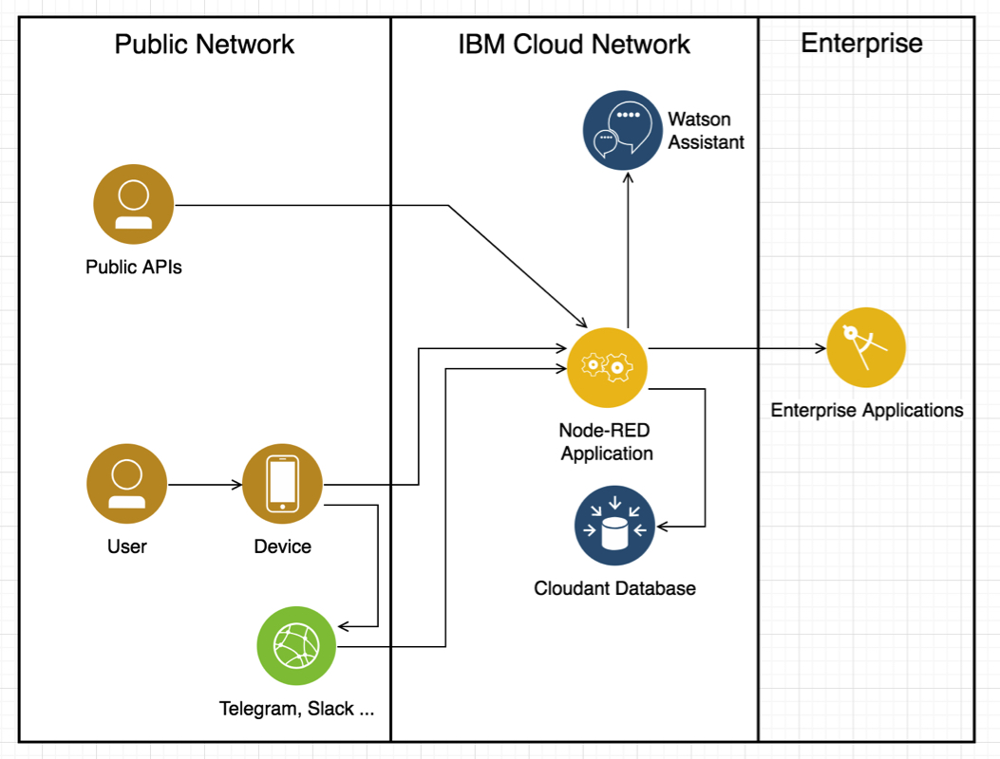
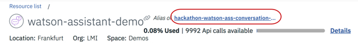
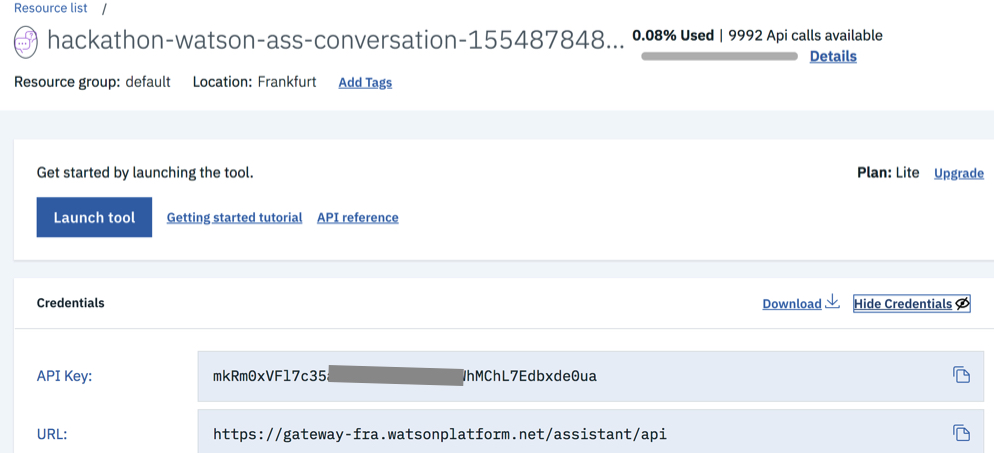
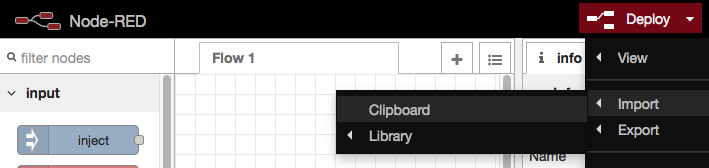
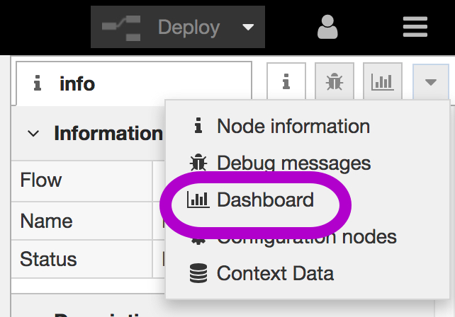
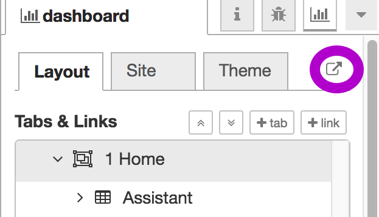
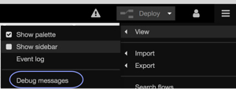
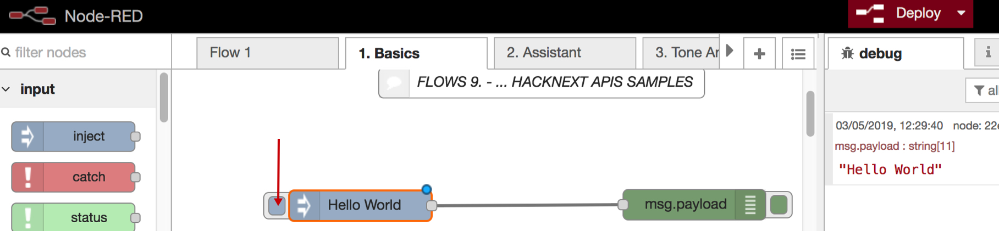
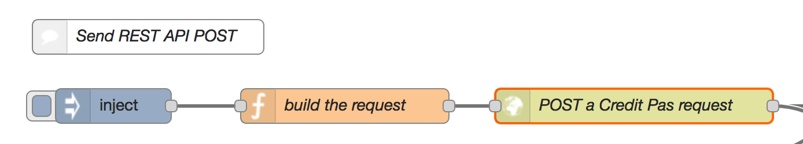
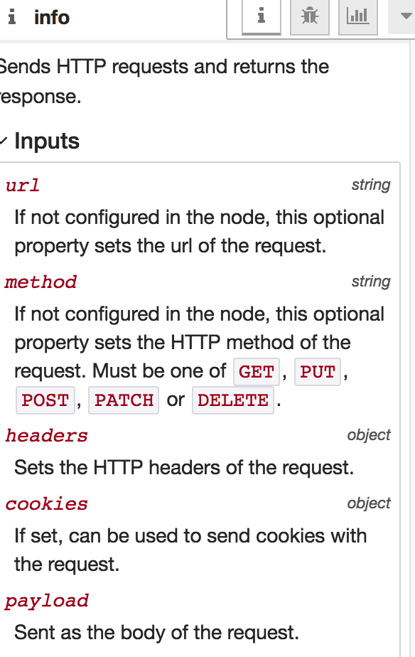

# Node-RED Watson Assistant Demo

The goal of this demo is to build a chatbot with IBM Watson Assistant and Node-RED. Node-RED is a visual programming and internet wiring tool which is quite useful for hackathons and prototypes. It connects all the devices with the cloud services, backend systems and external services.
The figure shows a sample architecture.



This demo guide is based on a [tutorial](https://github.com/thomassuedbroecker/hackathons_and_node-red) by [Thomas Suedbroecker (@tsuedbroecker)](https://twitter.com/tsuedbroecker), which also contains some videos. 

Hope you find this useful and have fun trying it out. Feedback including issues and contributions is certainly welcome.  

# Prerequisites
You need an IBM Cloud account. Please [sign-up](https://cloud.ibm.com/) for the IBM Cloud, if not done already. If you are attending a hackathon you might get a special registration URL, e.g. http://ibm.biz/promo4yourhackathon (just an example, this link does not work).

# Watson Assistant Service
The Watson Assistant service is an artificial intelligence service within the IBM Cloud and can be found the AI category of the catalog.
## Installation
- go to the [Catalog](https://cloud.ibm.com/catalog), under *All Categories* on the left click on [AI](https://cloud.ibm.com/catalog?category=ai)
- click on *Watson Assistant* and choose a region, e.g. Frankfurt
- click on *Create*, the click on the alias



The service is now running and can be used.
- make note of the API key and the URL  


- click on *Launch tool* and on  *Skills* (in the top menu)

We are using a pre-installed skill that we can modify.
- click on the 3 dots of the pre-installed *Customer Care Sample Skill*
- click on *View API details* and make note of the workspace ID, the username (apikey) and der password (the 1st one)
- close the API details view and open the *Customer Care Sample Skill* by clicking on the center of the tile
Now you can see the tabs where you can modify the skill, primarily the intents, entities amnd the dialog.
- click on *Try it* at the upper right corner and enter *hello*

## Accessing the WA service

The Watson Assistant service can be accessed on various ways:
- SDKs (Go, Java, Node, Python, Ruby, Swift)
- Node-RED
- REST/curl

### Access via REST APIs/curl

This interface is documented in the [API reference](https://cloud.ibm.com/apidocs/assistant#get-response-to-user-input). Note, that the API endpoint (gateway-fra.watsonplatform.net) depends on the region.

**Example:**

```
curl -X POST -u "apikey:mkRm0xVF.........Edbxde0ua" --header "Content-Type:application/json" --data "{\"input\": {\"text\": \"Hello\"}}" "https://gateway-fra.watsonplatform.net/assistant/api/v1/workspaces/c321c0......eae0eb10d/message?version=2019-02-28"
```

# Install the Node-RED Starter Kit
- go to the [Catalog](https://cloud.ibm.com/catalog) and search for _Node-RED Starter_ or directly to [Create a Cloud Foundry App/Node-RED Starter](https://cloud.ibm.com/catalog/starters/node-red-starter)
- enter a unique App name, e.g. *myuniqueapp...*
- choose a region, organization, and a space or use the defaults
- click on *Create*, the app is now starting

 
- click on *Visit App URL*
- click *Next*
- enter a Node-RED *Username* and *Password* and click *Next* twice, then click *Finish*
- click on *Go to your Node-RED flow editor* and login

You have to add the Node-RED Dashboard (UI nodes) before you import the sample flow.

- select manage palatte from the menu on right upper side of the page


- now choose the tab *install*, search for Node-RED Dashboard (*node-red-dashboard*) and press *install*


Now you can import and deploy the sample flow
- import [this Node-RED flow](https://raw.githubusercontent.com/gitjps/hackathons_and_node-red/master/node-red-flows/node-flows-hackathon-hacknext-2019.json) via the clipboard 



- the sample code is now imported into several Node-RED flow which can be selected by clicking of the tabs
# Using the Dashboard
The dashboard nodes imported above are used to access the user interface.
## Accessing the Dashboard
- you can go to the UI (dashboard) if you click on *Dashboard*



and then on the little arrow



## Designing the Dashboard
Lots of tutorials are available, just search for *Dashboard Node-RED*, or see https://www.youtube.com/watch?v=X8ustpkAJ-U , for example.
# Hello World


- go to flow *1. Basics* and click on the red *Deploy* button to deploy and run all flows (click *Confirm deploy* and *Close*)
- enable the debug messages in the right sidebar
- now click on the button of the Hello World inject node



This way a message is generated (in attribute payload of the message), transferred to the green debug node, that displays it in the right sidebar.

# Calling the Watson Assistant from Node-RED

# Making HTTP Requests

With http requests you can send/receive data to/from external services. There's a sample POST request as a starting point.
- go to flow *9. useCreditpaas Api sample (Hacknext)*


- click on the *http POST request* node and then on the little i (information)


Here you can see a description of the node. The body (payload) and headers of the request are set in the *function node* "build the request". To invoke the request, click on *Inject* (the output of that node is not used).

# Provide a REST API
The Node-RED instance is reachable via REST APIs. The *http in* node is used to define the endpoint (route, method), see also https://cookbook.nodered.org/http/post-form-data-to-a-flow.

You can find an **example** if you
- go to flow *8. PROVIDE REST API (Basic)*

# Simple forwarding server

In case of CORS problems using Node-RED as REST server, a simple REST forwarding server based on Node.js, which is CORS enabled, might help, see https://github.com/gitjps/hackathons_and_node-red/tree/master/simple_forward_server. A [simple web app](https://github.com/gitjps/hackathons_and_node-red/tree/master/simple_web_app) can be used to check this.