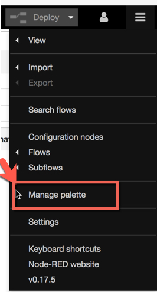
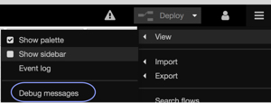
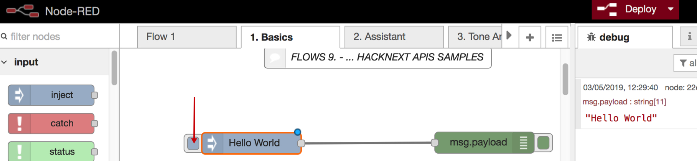

# Node-RED Watson Assistant Demo (draft)

The goal of this demo is to build a chatbot with IBM Watson Assistant and Node-RED. Node-RED is a visual programming and intenet wiring tool which is quite useful for hackathons and prototypes. It connects all the devices with the cloud services, backend systems and external services.
The figure shows a sample architecture.

The script is based on [this tutorial](https://github.com/thomassuedbroecker/hackathons_and_node-red), which also contains some videos. 
# Prereqs
You need an IBM Cloud account. Please [sign-up](https://cloud.ibm.com/) for the IBM Cloud if not done already. If you are attending a hackathon you might get a special registration URL.

# Install the Node-RED Starter Kit
- go to the [Catalog](https://cloud.ibm.com/catalog) and search for _Node-RED Starter_ or directly to [Create a Cloud Foundry App/Node-RED Starter](https://cloud.ibm.com/catalog/starters/node-red-starter)
- enter a unique App name, e.g. *myuniqueapp...*
- choose a region, organization, and a space or use the defaults
- click on *Create*, der app is now starting

 
- click on *Visit App URL*
- click *Next*
- enter a Node-RED *Username* and *Password* and click *Next* twice, then click *Finish*
- click on *Go to your Node-RED flow editor* and login

You have to add the Node-RED Dashboard (UI nodes) before you import the sample flow.

- select manage palatte from the menu on right upper side of the page

- now choose the tab *install*, search for Node-RED Dashboard (*node-red-dasgboard*) and press *install*

Now you can import and deploy the sample flow
- import [this Node-RED flow](https://raw.githubusercontent.com/gitjps/hackathons_and_node-red/master/node-red-flows/node-flows-hackathon-hacknext-2019.json) via the clipboard 

- the sample code is now imported into several Node-RED flow which can be selected by clicking of the tabs
- go to flow *1. Basics* and click on the red *Deploy* button to deploy and run all flows (click *Confirm deploy* and *Close*)
- enable the debug messages in the right side bar

- now click on the button of the Hello World inject node

This way a message is generated (in attribute payload of the message), transfered to the green debug node, that displays it in the right sidebar.

# Installation of the Watson Assistant

(to be continued)